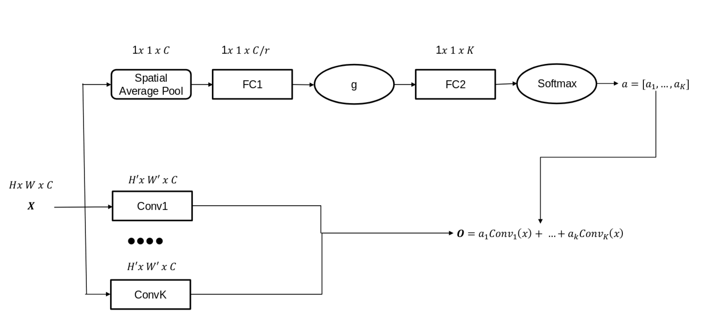
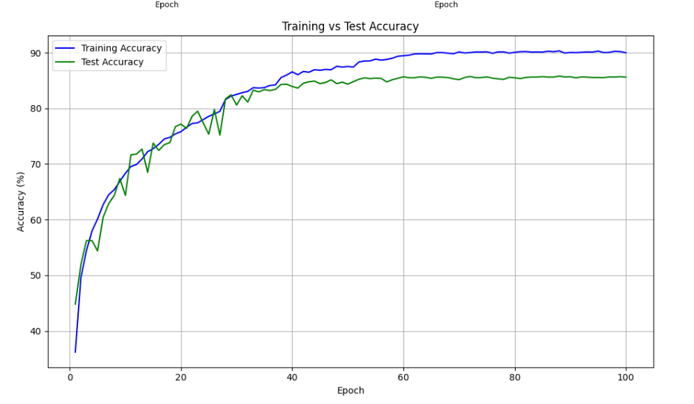
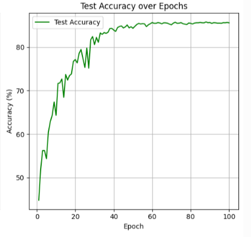

# CIFAR-10 Mixture-of-Experts Neural Network

A PyTorch implementation of a mixture-of-experts (MoE) convolutional neural network for CIFAR-10 image classification, achieving **85-86% test accuracy**.

## Architecture Overview

The model consists of four main components that work together to create an adaptive, expert-based classification system:

### Architecture Diagram

The diagram illustrates the complete data flow:
- Input **x** (H×W×C) is processed by K parallel convolutional experts
- Simultaneously, x passes through the gating network (Spatial Average Pool → FC1 → g → FC2 → Softmax)
- The softmax produces weights **a** = [a₁, ..., aₖ] for each expert
- Final output: **O** = a₁·Conv₁(x) + ... + aₖ·Convₖ(x)

### 1. **Stem** 
Initial feature extraction using two convolutional layers:
- First conv layer: 3 → 128 channels (initial feature extraction)
- Second conv layer: 128 → 256 channels (further feature refinement)
- Batch normalisation and dropout (0.3) after each layer

### 2. **ExpertBranch (Gating Network)**
A learned routing mechanism that determines expert weighting:
- Adaptive average pooling to handle variable input sises
- Two fully connected layers with ReLU activation
- Softmax output producing probability distribution over K experts
- Dynamically assigns importance to each expert based on input features

### 3. **ConvLayer (Experts)**
K independent convolutional experts (K=5):
- Each expert: 3×3 conv layer (256 → 256 channels)
- Batch normalisation and dropout for regularisation
- Experts automatically specialise during training to capture different visual patterns

### 4. **combinedModel (Classifier)**
Brings everything together:
- Processes stem output through the gating network
- Computes weighted sum of expert outputs
- Multi-layer perceptron classifier: 256 → 1024 → 128 → 32 → 10 classes
- Batch normalisation between FC layers to stabilise training

## How Mixture-of-Experts Works

The key innovation is **dynamic expert weighting**:

1. Each image passes through the Stem for initial feature extraction
2. The ExpertBranch (gating network) analyses these features and outputs a probability distribution over the 5 experts
3. Each expert processes the features independently
4. Outputs are combined using the learned weights: `weighted_sum = Σ(expert_i(x) × weight_i)`
5. The weighted sum is classified by the final MLP

**Benefits:**
- Experts naturally specialise to different visual patterns during training
- Different images utilise different expert combinations
- Increased model capacity without simply stacking layers
- Conditional computation based on input characteristics

## Key Implementation Details

### Data Augmentation
To reduce overfitting and improve generalisation:
- Random cropping (32×32 with padding=4)
- Random horisontal flip (p=0.5)
- Random rotation (±10 degrees)
- Color jitter (brightness, contrast, saturation, hue)
- Normalisation using CIFAR-10 dataset statistics

### Training Strategy
- **Optimiser:** AdamW (lr=0.001) with weight decay for regularisation
- **Scheduler:** ReduceLROnPlateau to prevent plateau around 70% accuracy
  - Reduces learning rate by 0.5× when validation loss plateaus
  - Patience: 3 epochs
  - Min learning rate: 1e-6
- **Loss Function:** CrossEntropyLoss
- **Epochs:** 100
- **Batch Sise:** 64

### Hyperparameters

| Parameter | Value | Impact |
|-----------|-------|--------|
| K (Number of Experts) | 5 | **High** - Most significant performance factor |
| Channels | 256 | **High** - Large effect on capacity |
| r (Reduction ratio) | 8 | **Medium** - Less significant impact |
| Kernel Sise | 3×3 | Standard for CIFAR-10 |

These hyperparameters were selected based on their performance impact, with K and Channels being the primary tuning targets.

## Performance

- **Test Accuracy:** 85-86% (average)
- **Training Accuracy:** Closely tracks test accuracy until ~epoch 40
- **Known Issue:** Slight overfitting observed after epoch 40 (training accuracy continues rising while test accuracy plateaus)

### Training Behavior
- Initial rapid improvement in first 10-20 epochs
- Steady gains until epoch 40
- Plateau and minor overfitting in later epochs
- Scheduler successfully prevents early plateauing at 70%

### Training Results

**Training vs Test Accuracy**

The graph shows close similarity between training and test accuracy throughout training, with a slight divergence after epoch 40 indicating minor overfitting. Both curves plateau around 86-90% accuracy.

**Test Accuracy Over Epochs**

Test accuracy shows steady improvement from ~50% to ~86%, with most gains occurring in the first 40 epochs before stabilising.

**Final Thoughts and Reflections**

Honestly, I wish I'd worked more on this to push it over 90%. However, issues like time and the large cost of computer credits were building up. I do think this is a really cool archiecture and I will work on this more when I have more time!

